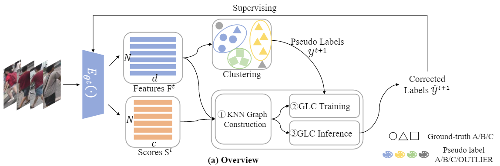

# Plug-and-Play Pseudo Label Correction Network for Unsupervised Person Re-identification [[pdf]](https://arxiv.org/abs/2206.06607)
The *official* repository for [Plug-and-Play Pseudo Label Correction Network for Unsupervised Person Re-identification](https://arxiv.org/abs/2203.03931)

## Requirements

### Installation
```bash
pip install -r requirements.txt
```
We recommend to use /torch=1.12.0 /torchvision=0.13.0 /timm=0.9.2 /cuda>11.6 /faiss-gpu=1.6.4/ GeForce 3090 for training and evaluation. If you find some packages are missing, please install them manually.
You can refer to [DINO](https://github.com/facebookresearch/dino), [TransReID-SSL](https://github.com/damo-cv/TransReID-SSL) and [cluster-contrast-reid](https://github.com/alibaba/cluster-contrast-reid) to install the environment of pre-training and unsupervised ReID, respectively. 
You can also refer to [PASS](https://github.com/CASIA-IVA-Lab/PASS-reID) to install the whole environments.

### Prepare Datasets

```bash
mkdir data
```

Download the datasets:
- [Market-1501](https://drive.google.com/file/d/0B8-rUzbwVRk0c054eEozWG9COHM/view)
- [MSMT17](https://arxiv.org/abs/1711.08565)
- [LUPerson](https://github.com/DengpanFu/LUPerson). We don't have the copyright of the LUPerson dataset. Please contact authors of LUPerson to get this dataset.

Then unzip them and rename them under the directory like

```
data
├── market1501
│   └── bounding_box_train
│   └── bounding_box_test
│   └── ..
├── MSMT17
│   └── train
│   └── test
│   └── ..
└── LUP
    └── images 
```

## Getting Started

### Train
You can run these commands in .sh files for training different datasets with GLC.

1.Market1501
```bash
bash PASS_cluster_contrast_reid/shell/market_usl_glc_restart.sh 
```
2.MSMT17
```bash
bash PASS_cluster_contrast_reid/shell/msmt_usl_glc_restart.sh 
```

### Usage
Our GLC is plug and play, you can insert the module to ReID method for higher performance.
```bash
from star.run_ import run_cluster
```

## Pre-trained Models
| Model         | Download |
| :------:      | :------: |
| ResNet50      | [link](https://drive.google.com/file/d/1ECeWc7DiEjyargckTb3S_n1nhInztIBl/view?usp=sharing) |
| ResNet50-IBN  | [link](https://drive.google.com/file/d/1N_PDpTykg6xkmgLHOn5CGoc0odT3c9xE/view?usp=sharing) |
| ViT-S/16      | [link](https://drive.google.com/file/d/1ODxA7mJv17UfzwfXtY9dTWNsYghoNWGB/view?usp=sharing) |
| ViT-S/16+ICS  | [link](https://drive.google.com/file/d/18FL9JaJNlo15-UksalcJRXX-0dgo4Mz4/view?usp=sharing) |

Please download pre-trained models and put them into your custom file path.

## ReID performance

We have reproduced the performance to verify the reproducibility. The reproduced results may have a gap of about 0.1~0.2% with the numbers in the paper.

### USL ReID

##### Market-1501
| Method        | Model         | Image Size| mAP | Rank-1 | Download |
| :------:      | :------:      | :------: |:------: | :------: |:------: |
| PASS          | ViT-S/16      | 256*128  | 89.3 | 95.0 |[model](https://drive.google.com/file/d/1dzbbNzbN5N8hs_mqWh-ff_ufzsn2Q06Y/view?usp=sharing)|


##### MSMT17
| Method        | Model         | Image Size| mAP | Rank-1 | Download |
| :------:      | :------:      | :------: |:------: | :------: |:------: |
| PASS          | ViT-S/16      | 256*128  | 45.6 | 71.1 |[model](https://drive.google.com/file/d/1hqYmHRXVihAoyXzamQAV7qSh0vZEeqiV/view?usp=sharing)|

### UDA ReID

##### MSMT2Market
| Method        | Model         | Image Size| mAP | Rank-1 | Download |
| :------:      | :------:      | :------: |:------: | :------: |:------: |
| PASS          | ViT-S/16      | 256*128  | 90.5 | 96.0 |[model](https://drive.google.com/file/d/1Z62V24cjqE_iQCWVS5-VSpHFgSU4zUXo/view?usp=sharing)|

##### Market2MSMT
| Method        | Model         | Image Size| mAP | Rank-1 | Download |
| :------:      | :------:      | :------: |:------: | :------: |:------: |
| PASS          | ViT-S/16      | 256*128  | 52.0 | 75.1 |[model](https://drive.google.com/file/d/1CZryZv71_g1RqzIfV1t0_SJAjUeqyYWV/view?usp=sharing)|

## Acknowledgment
Our implementation is mainly based on the following codebases. We gratefully thank the authors for their wonderful works.

[PASS](https://github.com/CASIA-IVA-Lab/PASS-reID),[TransReID-SSL](https://github.com/damo-cv/TransReID-SSL),[cluster-contrast-reid](https://github.com/alibaba/cluster-contrast-reid),[STAR-FC](https://github.com/sstzal/STAR-FC)

## Citation

If you find this code useful for your research, please cite our paper

```
@article{yan2022plug,
  title={Plug-and-Play Pseudo Label Correction Network for Unsupervised Person Re-identification},
  author={Yan, Tianyi and Zhu, Kuan and Zhu, Guibo and Tang, Ming and Wang, Jinqiao and others},
  journal={arXiv preprint arXiv:2206.06607},
  year={2022}
}
```

## Contact

If you have any question, please feel free to contact us. E-mail: [anhongyan2022@ia.ac.cn](anhongyan2022@ia.ac.cn).
